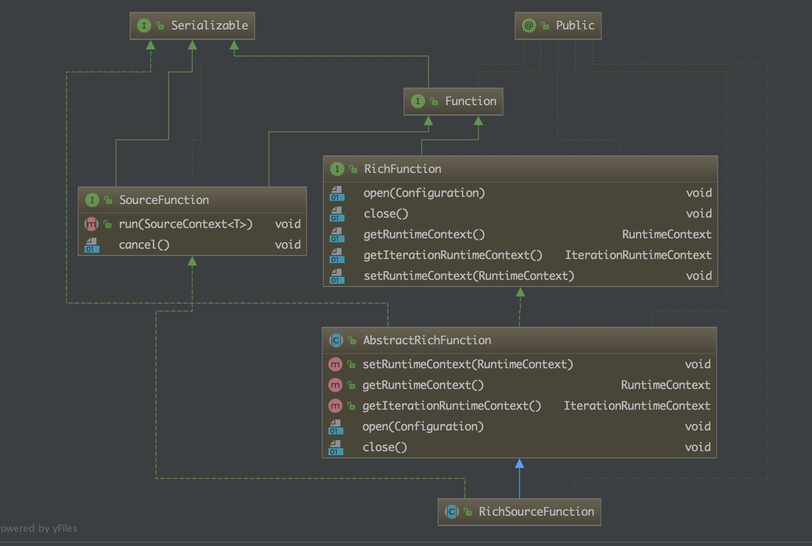

到达窗口操作符的元素被传递给 WindowAssigner。WindowAssigner 将元素分配给一个或多个窗口，可能会创建新的窗口。
窗口本身只是元素列表的标识符，它可能提供一些可选的元信息，例如 TimeWindow 中的开始和结束时间。
注意，元素可以被添加到多个窗口，这也意味着一个元素可以同时在多个窗口存在。

每个窗口都拥有一个 Trigger(触发器)，该 Trigger(触发器) 决定何时计算和清除窗口。
当先前注册的计时器超时时，将为插入窗口的每个元素调用触发器。在每个事件上，
触发器都可以决定触发(即、清除(删除窗口并丢弃其内容)，或者启动并清除窗口。
一个窗口可以被求值多次，并且在被清除之前一直存在。注意，在清除窗口之前，窗口将一直消耗内存。

当 Trigger(触发器) 触发时，可以将窗口元素列表提供给可选的 Evictor，
Evictor 可以遍历窗口元素列表，并可以决定从列表的开头删除首先进入窗口的一些元素。
然后其余的元素被赋给一个计算函数，如果没有定义 Evictor，触发器直接将所有窗口元素交给计算函数。

计算函数接收 Evictor 过滤后的窗口元素，并计算窗口的一个或多个元素的结果。 
DataStream API 接受不同类型的计算函数，包括预定义的聚合函数，如 
sum（），min（），max（），以及 ReduceFunction，FoldFunction 或 WindowFunction。

# window
 窗口分为四类：tumbling window , sliding window . session window ,global window
 stream.keyBy(...)          <-  keyed versus non-keyed windows
        .window(...)         <-  required: "assigner"
       [.trigger(...)]       <-  optional: "trigger" (else default trigger)
       [.evictor(...)]       <-  optional: "evictor" (else no evictor)
       [.allowedLateness()]  <-  optional, else zero
        .reduce/fold/apply() <-  required: "function"

   stream.windowAll(...)      <-  required: "assigner"
  [.trigger(...)]       <-  optional: "trigger" (else default trigger)
  [.evictor(...)]       <-  optional: "evictor" (else no evictor)
  [.allowedLateness()]  <-  optional, else zero
   .reduce/fold/apply() <-  required: "function"

   Flink 确保了只清除基于时间的window，其他类型的window不清除
## tumbling window
   // tumbling event-time windows
 input
     .keyBy(<key selector>)
     .window(TumblingEventTimeWindows.of(Time.seconds(5)))
     .<windowed transformation>(<window function>);

 // tumbling processing-time windows
 input
     .keyBy(<key selector>)
     .window(TumblingProcessingTimeWindows.of(Time.seconds(5)))
     .<windowed transformation>(<window function>);

 // daily tumbling event-time windows offset by -8 hours.
 input
     .keyBy(<key selector>)
     .window(TumblingEventTimeWindows.of(Time.days(1), Time.hours(-8)))
     .<windowed transformation>(<window function>);
     
##  sliding window
  DataStream<T> input = ...;

 // sliding event-time windows
 input
     .keyBy(<key selector>)
     .window(SlidingEventTimeWindows.of(Time.seconds(10), Time.seconds(5)))
     .<windowed transformation>(<window function>);

 // sliding processing-time windows
 input
     .keyBy(<key selector>)
     .window(SlidingProcessingTimeWindows.of(Time.seconds(10), Time.seconds(5)))
     .<windowed transformation>(<window function>);

 // sliding processing-time windows offset by -8 hours
 input
     .keyBy(<key selector>)
     .window(SlidingProcessingTimeWindows.of(Time.hours(12), Time.hours(1), Time.hours(-8)))
     .<windowed transformation>(<window function>);
     
##  session window 
DataStream<T> input = ...;

// event-time session windows
input
    .keyBy(<key selector>)
    .window(EventTimeSessionWindows.withGap(Time.minutes(10)))
    .<windowed transformation>(<window function>);

// processing-time session windows
input
    .keyBy(<key selector>)
    .window(ProcessingTimeSessionWindows.withGap(Time.minutes(10)))
    .<windowed transformation>(<window function>);
    
## global window 
DataStream<T> input = ...;

input
    .keyBy(<key selector>)
    .window(GlobalWindows.create())
    .<windowed transformation>(<window function>);

# window function 
DataStream<Tuple2<String, Long>> input = ...;

input
    .keyBy(<key selector>)
    .window(<window assigner>)
    .reduce(new ReduceFunction<Tuple2<String, Long>> {
      public Tuple2<String, Long> reduce(Tuple2<String, Long> v1, Tuple2<String, Long> v2) {
        return new Tuple2<>(v1.f0, v1.f1 + v2.f1);
      }
    });
    
    
DataStream<Tuple2<String, Long>> input = ...;

input
    .keyBy(<key selector>)
    .window(<window assigner>)
    .fold("", new FoldFunction<Tuple2<String, Long>, String>> {
       public String fold(String acc, Tuple2<String, Long> value) {
         return acc + value.f1;
       }
    });

DataStream<Tuple2<String, Long>> input = ...;

input
    .keyBy(<key selector>)
    .window(<window assigner>)
    .apply(new MyWindowFunction());

/* ... */

public class MyWindowFunction implements WindowFunction<Tuple<String, Long>, String, String, TimeWindow> {

  void apply(String key, TimeWindow window, Iterable<Tuple<String, Long>> input, Collector<String> out) {
    long count = 0;
    for (Tuple<String, Long> in: input) {
      count++;
    }
    out.collect("Window: " + window + "count: " + count);
  }
}

#  Triggers
The trigger interface has five methods that allow a Trigger to react to different events:

The onElement() method is called for each element that is added to a window.
The onEventTime() method is called when a registered event-time timer fires.
The onProcessingTime() method is called when a registered processing-time timer fires.
The onMerge() method is relevant for stateful triggers and merges the states of two triggers when their corresponding windows merge, e.g. when using session windows.
Finally the clear() method performs any action needed upon removal of the corresponding window.

Two things to notice about the above methods are:

1) The first three decide how to act on their invocation event by returning a TriggerResult. The action can be one of the following:

CONTINUE: do nothing,
FIRE: trigger the computation,
PURGE: clear the elements in the window
FIRE_AND_PURGE: trigger the computation and clear the elements in the window afterwards.
2) Any of these methods can be used to register processing- or event-time timers for future actions.

Flink comes with a few built-in triggers.

The (already mentioned) EventTimeTrigger fires based on the progress of event-time as measured by watermarks.
The ProcessingTimeTrigger fires based on processing time.
The CountTrigger fires once the number of elements in a window exceeds the given limit.
The PurgingTrigger takes as argument another trigger and transforms it into a purging one.

# Evictors
The evictor has the ability to remove elements from a window after the trigger fires 
and before and/or after the window function is applied. 

CountEvictor: keeps up to a user-specified number of elements from the window and discards the remaining ones from the beginning of the window buffer.
DeltaEvictor: takes a DeltaFunction and a threshold, computes the delta between the last element in the window buffer and each of the remaining ones, and removes the ones with a delta greater or equal to the threshold.
TimeEvictor: takes as argument an interval in milliseconds and for a given window, it finds the maximum timestamp max_ts among its elements and removes all the elements with timestamps smaller than max_ts - interval.

# Allowed Lateness
By default, late elements are dropped when the watermark is past the end of the window. However, Flink allows to specify a maximum allowed lateness for window operators.

#### Project 函数允许您从事件流中选择属性子集，并仅将所选元素发送到下一个处理流。
DataStream<Tuple4<Integer, Double, String, String>> in = // [...] 
DataStream<Tuple2<String, String>> out = in.project(3,2);
 
 #  watermark trigger accumulation
 Watermarks: A watermark is a notion of input completeness with respect to event times.
  A watermark with a value of time X makes the statement: “all input data with event times 
  less than X have been observed.” As such, watermarks act as a metric of progress when
   observing an unbounded data source with no known end.
 Triggers: A trigger is a mechanism for declaring when the output for a window 
 should be materialized relative to some external signal. Triggers provide flexibility in choosing 
 when outputs should be emitted. They also make it possible to observe the output for a window
  multiple times as it evolves. This in turn opens up the door to refining results over time, which 
  allows for providing speculative results as data arrive as well as dealing with changes in upstream 
  data (revisions) over time or data which arrive late relative to the watermark (e.g., mobile scenarios, 
  where someone’s phone records various actions and their event times while the person is offline, 
  then proceeds to upload those events for processing upon regaining connectivity).
 Accumulation: An accumulation mode specifies the relationship between multiple results 
 that are observed for the same window. Those results might be completely disjointed, i.e., 
 representing independent deltas over time, or there may be overlap between them. Different 
 accumulation modes have different semantics and costs associated with them, and thus 
 find applicability across a variety of use cases.
 
 # Flink CEP 
 <dependency>
   <groupId>org.apache.flink</groupId>
   <artifactId>flink-cep_2.11</artifactId>
   <version>1.10.0</version>
 </dependency>
 
 Attention 
 The events in the DataStream to which you want to apply pattern matching 
 must implement proper equals() and hashCode() methods because FlinkCEP
  uses them for comparing and matching events.
  
